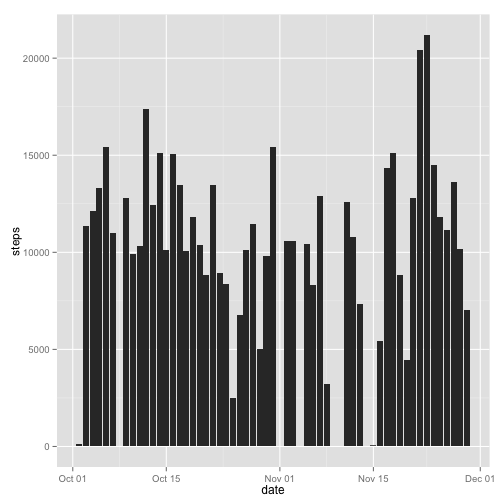

# Reproducible Research: Peer Assessment 1


## Loading and preprocessing the data

*Load the data*

```r
df <- read.csv("activity.csv")
```


*Process the data*

```r
df$date <- as.Date(df$date)
```


## What is mean total number of steps taken per day?

*Histogram of the total number of steps taken each day*

```r
df_agg <- aggregate(steps ~ date, df, sum)
ggplot(df_agg, aes(date, steps)) + geom_bar(stat = "identity")
```

 


*Mean and median of total number of steps taken per day*

```r
mean(df_agg$steps)
```

```
## [1] 10766
```

```r
median(df_agg$steps)
```

```
## [1] 10765
```


## What is the average daily activity pattern?

*Time series plot*

```r
df_agg <- aggregate(steps ~ interval, df, mean)
plot(df_agg, type = "l")
```

 


*Maximum number of steps on interval*

```r
df_agg[which.max(df_agg$steps), ]$interval
```

```
## [1] 835
```


## Imputing missing values

*Missing values in the dataset (rows with NAs)*

```r
table(complete.cases(df))[["FALSE"]]
```

```
## [1] 2304
```


*Filling in all of the missing values in the dataset*

```r
get_mean_steps <- function(x) subset(df_agg, interval == x)$steps
na_filter <- is.na(df$steps)
intervals <- df[na_filter, ]$interval
```


*New dataset with missing data filled in*

```r
df_ <- data.frame(df)
df_$steps[which(na_filter)] <- sapply(intervals, get_mean_steps)
```


*Histogram of the total number of steps taken each day*

```r
df_agg <- aggregate(steps ~ date, df_, sum)
ggplot(df_agg, aes(date, steps)) + geom_bar(stat = "identity")
```

 


*Mean and median total number of steps taken per day*

```r
mean(df_agg$steps)
```

```
## [1] 10766
```

```r
median(df_agg$steps)
```

```
## [1] 10766
```


*Do these values differ from the estimates from the first part of the assignment?*

No, since the missing data was replaced by the average data in each interval, so the total mean must be the same and the media, close to the original median.

*What is the impact of imputing missing data on the estimates of the total daily number of steps?*

Almost insignificant, specially if we have enough real data.


## Are there differences in activity patterns between weekdays and weekends?

*New dataframe variable for weekdays/weekend days*

```r
x <- weekdays(df_agg$date) %in% c("Saturday", "Sunday")
f <- function(x) if (x) "weekend" else "weekday"
df_$day_type <- lapply(x, f)
```


*Time series plot of the 5-minute interval and the average number of steps taken*

```r
df_agg_weekday <- aggregate(steps ~ interval, subset(df_, day_type == "weekday"), 
    sum)
df_agg_weekend <- aggregate(steps ~ interval, subset(df_, day_type == "weekend"), 
    sum)
par(mfrow = c(2, 1))
y_max <- max(c(df_agg_weekday$steps, df_agg_weekend$steps))
plot(df_agg_weekday, type = "l", main = "Weekday", ylim = c(0, y_max))
plot(df_agg_weekend, type = "l", main = "Weekend", ylim = c(0, y_max))
```

 

